<!--
  ╔══════════════════════════════════════════════════════════════════╗
  ║  NipunSingh999 · GitHub Profile README                            ║
  ║  HOW TO USE:                                                       ║
  ║  1. Create a new PUBLIC repo named exactly "NipunSingh999"         ║
  ║     (must match your GitHub username exactly).                    ║
  ║  2. Add BOTH this README.md and the assets/ folder                ║
  ║     (assets/identity-scan.svg) to that repo, keeping the same      ║
  ║     folder structure — the scan animation loads from that path.   ║
  ║  3. Your LinkedIn, email & LeetCode links are already filled in.   ║
  ║  4. Everything here (typing effect, scan animation, stats cards)   ║
  ║     is free, auto-updating, and needs no API key.                 ║
  ╚══════════════════════════════════════════════════════════════════╝
-->

 

 

 

## About Me

- 🎓 Final year B.Tech CSE student at I.T.S. Engineering College, Greater Noida (2023 – 2027), based in Delhi NCR.
- 🔭 Building my final-year capstone: an **AI-based price comparison app** aligned with **SDG 12**, with a 4-member team — features include voice search, AI review summaries, a regional-language assistant, shareable reports, and wishlists.
- 💸 Also building **SpendBite** — an Android app that auto-tracks food-delivery spend (Swiggy, Zomato, Blinkit, Zepto) via SMS, with budgeting and group expense splitting.
- 🤖 Built an offline **deepfake detector** using Kotlin + TensorFlow Lite.
- 🧩 Solved 180+ DSA problems across LeetCode and GeeksforGeeks, and hold an **AWS Academy Cloud Foundations** certification.
- 🎯 Open to **Android Developer / ML Engineer** internships and full-time roles.

 

## Tech Stack

**Languages**
 

**Android & Mobile**
 

**AI / ML**
 

**Backend & Cloud**
 

**Tools**
 

 

## Featured Projects

<table width="100%">
<tr>
<td width="50%" valign="top">

### 💸 [SpendBite](https://github.com/NipunSingh999/SpendBite)
Automated personal-finance Android app that auto-syncs food-delivery spend (Swiggy/Zomato/Blinkit/Zepto) from SMS, tracks budgets & subscription ROI, and splits group expenses via **Split-Bite Hub**.

`Kotlin` `MVVM` `Firebase` `Room` `Retrofit` `Coroutines`

</td>
<td width="50%" valign="top">

### 🛒 AI Price Comparison App *(in progress)*
Final-year capstone aligned with **SDG 12**. Compares prices across platforms with voice search, AI-generated review summaries, and Hindi/regional-language assistant support.

`AI/ML` `NLP` `Team Project` `SDG 12`

</td>
</tr>
<tr>
<td width="50%" valign="top">

### 💧 [Intelligent Water Distribution System](https://github.com/NipunSingh999/Intelligent-Water-Distribution-System)
Real-time water leak detection & monitoring system simulating IoT sensors, mapped to **SDG 11 — Sustainable Cities**.

`IoT Simulation` `MQTT` `Flask` `ML`

</td>
<td width="50%" valign="top">

### 🎬 [YouTube Transcript Summarizer](https://github.com/NipunSingh999/youtube_transcript_summarizer)
Chrome extension that pulls YouTube transcripts and generates concise AI-powered summaries.

`Python` `Flask` `Hugging Face Transformers`

</td>
</tr>
<tr>
<td width="50%" valign="top">

### ⏸️ [Tab Video Auto-Pause](https://github.com/NipunSingh999/Tab-Video-Auto-Pause)
Chrome extension that auto-pauses YouTube playback on tab switch and resumes on return — distraction-free viewing.

`JavaScript` `Chrome Extension API`

</td>
<td width="50%" valign="top">

</td>
</tr>
</table>

 

## GitHub Stats

 

## Currently

- 🎓 Final year at I.T.S. Engineering College, Greater Noida (2023 – 2027)
- 🔬 Building the AI Price Comparison App (SDG 12) as my final-year project
- 📱 Sharpening Jetpack Compose, Hilt, and clean architecture skills
- 🧩 180+ DSA problems solved on LeetCode / GeeksforGeeks
- 💼 Open to Android Developer & ML Engineer internships / full-time roles

 

### Let's Connect

  

